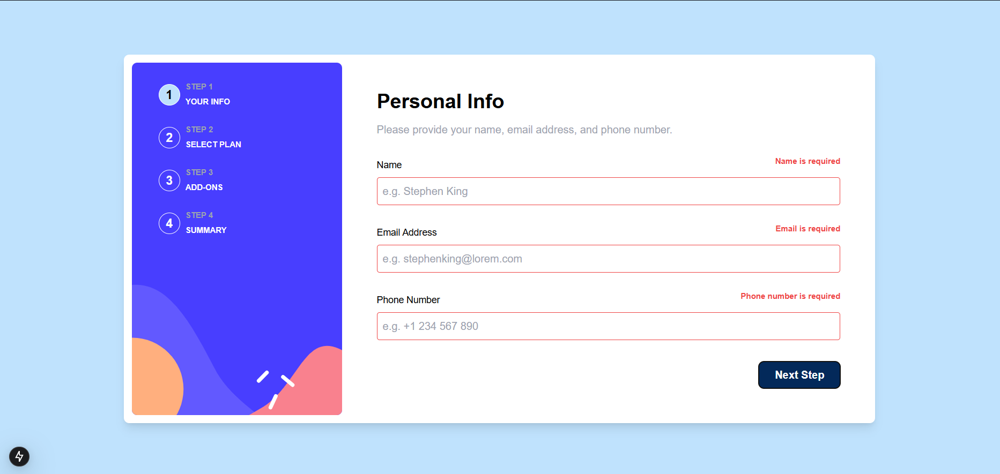
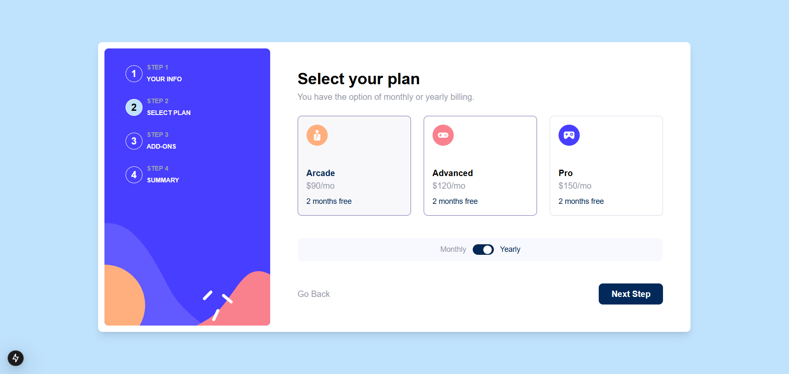
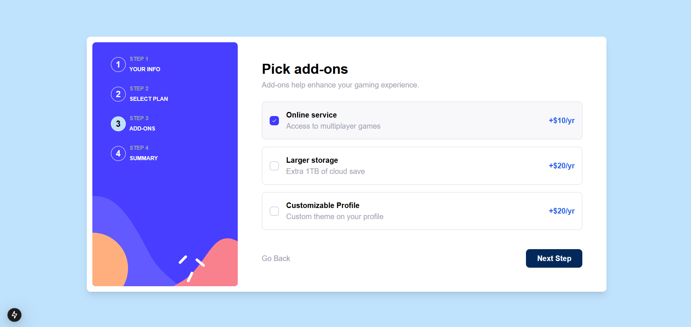
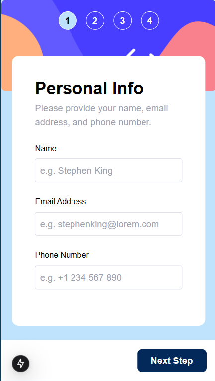
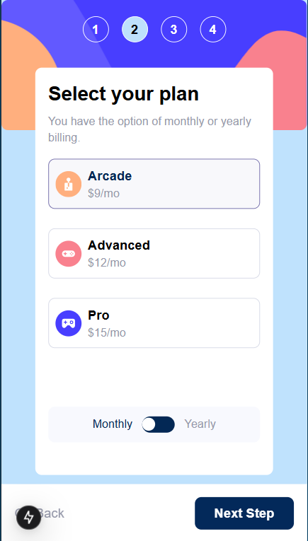
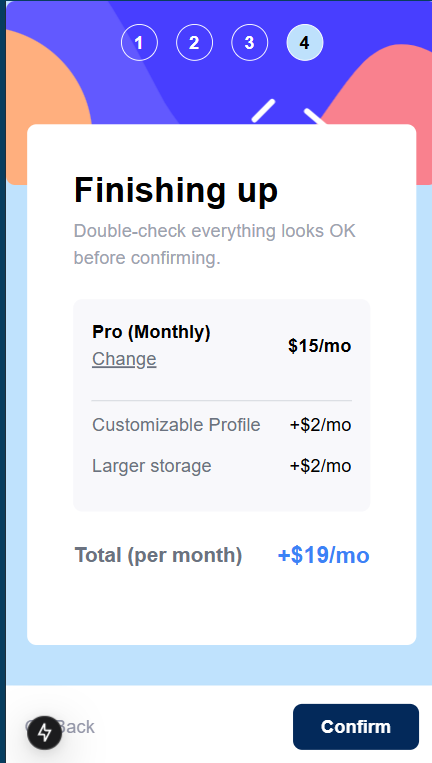

# 📝 Multi-step Form Solution


Esta é uma solução para o [Multi-step form challenge no Frontend Mentor](https://www.frontendmentor.io/challenges/multistep-form-YVAnSdqQBJ). Os desafios do Frontend Mentor ajudam a melhorar as habilidades de codificação através da construção de projetos realistas.

## 📑 Índice

- [🔍 Visão Geral](#visão-geral)
  - [🎯 O Desafio](#o-desafio)
  - [📸 Screenshot](#screenshot)
  - [🔗 Links](#links)
- [💻 Meu Processo](#meu-processo)
  - [🛠️  Tecnologias Utilizadas](#tecnologias-utilizadas)
  - [📚 O que Aprendi](#o-que-aprendi)
- [⚙️ Como Executar](#como-executar)
- [👤 Autor](#autor)
- [🌎 English Version](#english-version)

## 🔍 Visão Geral

### 🎯 O Desafio

Os usuários devem ser capazes de:

- Completar cada etapa do sequência do formulário
- Voltar para uma etapa anterior para atualizar suas seleções
- Ver um sumário de suas seleções na etapa final e confirmar seu pedido
- Ver o layout ideal para a interface dependendo do tamanho da tela do dispositivo
- Ver os estados de hover e focus para todos os elementos interativos na página
- Receber mensagens de validação de formulário se:
  - Um campo foi deixado em branco
  - O endereço de email está em formato incorreto
  - Um passo é enviado, mas nenhuma seleção foi feita

### 📸 Screenshot





<table>
  <tr>
    <td></td>
    <td></td>
    <td></td>
  </tr>
</table>

### 🔗 Links

- URL da Solução: [Adicione a URL da solução](https://your-solution-url.com)
- URL do Site: [Adicione a URL do site](https://your-live-site-url.com)

## 💻 Meu Processo

### 🛠️ Tecnologias Utilizadas

- [Next.js](https://nextjs.org/) - Framework React
- [React](https://reactjs.org/) - Biblioteca JS
- [TypeScript](https://www.typescriptlang.org/) - Superset JavaScript
- [Tailwind CSS](https://tailwindcss.com/) - Para estilos
- Mobile-first workflow
- Componentes React reutilizáveis
- Gerenciamento de estado com React Hooks

### 📚 O que Aprendi

Durante o desenvolvimento deste projeto, adquiri diversos conhecimentos importantes:

#### Gerenciamento de Estado

```typescript
const [currentStep, setCurrentStep] = useState(1);
const [selectedPlan, setSelectedPlan] = useState<{
  name: string;
  price: number;
}>({ name: "Arcade", price: 9 });
```

Aprendi a gerenciar estados complexos em React, mantendo dados consistentes entre diferentes componentes do formulário multi-etapas.

#### Responsividade com Tailwind

```tsx
<div className={`bg-white rounded-lg relative flex flex-col justify-between
  ${isMobile ? 'p-4 h-[75vh] w-full' : 'p-10 h-full w-full rounded-r-lg'}`}>
```

Aprimorei minhas habilidades com Tailwind CSS, criando layouts responsivos e adaptáveis para diferentes tamanhos de tela.

#### Validação de Formulários

```typescript
const validateForm = () => {
  const emailPattern = /^[^\s@]+@[^\s@]+\.[^\s@]+$/;
  if (!formData.email || !emailPattern.test(formData.email)) {
    setErrors((prev) => ({ ...prev, email: "Email is invalid" }));
    return false;
  }
  return true;
};
```

Implementei validações de formulário personalizadas com feedback visual para o usuário.

#### Componentização

Aprendi a criar componentes reutilizáveis e modulares, melhorando a manutenibilidade do código:

- Separação de componentes por responsabilidade
- Uso de interfaces TypeScript para props
- Compartilhamento de estados entre componentes

#### Detecção de Dispositivo

```typescript
useEffect(() => {
  const handleResize = () => setIsMobile(window.innerWidth < 640);
  handleResize();
  window.addEventListener("resize", handleResize);
  return () => window.removeEventListener("resize", handleResize);
}, []);
```

Implementei detecção responsiva de dispositivos usando React Hooks.

#### Boas Práticas

- Uso do "use client" para componentes client-side
- Tipagem forte com TypeScript
- Gerenciamento de eventos e efeitos colaterais
- Padrões de UI/UX para formulários multi-etapas

Este projeto me permitiu aplicar conceitos avançados de desenvolvimento front-end e melhorar minhas habilidades com o ecossistema React/Next.js.

## ⚙️ Como Executar

1. Clone o repositório:

```bash
git clone https://github.com/Sub-Dev/multi-step-form-nextjs.git
```

2. Instale as dependências:

```bash
npm install
# ou
yarn install
```

3. Execute o servidor de desenvolvimento:

```bash
npm run dev
# ou
yarn dev
```

4. Abra [http://localhost:3000](http://localhost:3000) no seu navegador para ver o resultado.

## 👤 Autor

<table>
 <tr>
 <td alinhar="centro">
 <a href="https://github.com/Sub-Dev" target="_blank">
 
 </a>
 </td>
 <td>
 <strong>Anthony Marin</strong> (Sub-Dev) - <a href="https://github.com/Sub-Dev">Perfil no GitHub</a>
 </td>
 </tr>
</table>

- Frontend Mentor - [@Sub-Dev](https://www.frontendmentor.io/profile/Sub-Dev)

## 🙏 Agradecimentos

Agradecimentos especiais à comunidade de código aberto pelos recursos e ferramentas inestimáveis ​​que tornaram este projeto possível.

## 📝 Licença

Este projeto está licenciado sob a Licença MIT.

---

<h2 align="center">🌎 English Version 🌎</h2>

# 📝 Multi-step Form Solution

This is a solution to the [Multi-step form challenge on Frontend Mentor](https://www.frontendmentor.io/challenges/multistep-form-YVAnSdqQBJ). Frontend Mentor challenges help you improve your coding skills by building realistic projects.

## 📑 Table of contents

- [🔍 Overview](#overview)
  - [🎯 The Challenge](#the-challenge)
  - [📸 Screenshot](#screenshot-1)
  - [🔗 Links](#links-1)
- [💻 My Process](#my-process)
  - [🛠️ Built with](#built-with)
  - [📚 What I Learned](#what-i-learned)
- [⚙️ How to Run](#how-to-run)
- [👤 Author](#author-1)

## 🔍 Overview

### 🎯 The Challenge

Users should be able to:

- Complete each step of the sequence
- Go back to a previous step to update their selections
- See a summary of their selections on the final step and confirm their order
- View the optimal layout for the interface depending on their device's screen size
- See hover and focus states for all interactive elements on the page
- Receive form validation messages if:
  - A field has been missed
  - The email address is not formatted correctly
  - A step is submitted, but no selection has been made

### 📸 Screenshot


<table>
  <tr>
    <td></td>
    <td></td>
    <td></td>
  </tr>
</table>

### 🔗 Links

- Solution URL: [Add solution URL here](https://your-solution-url.com)
- Live Site URL: [Add live site URL here](https://your-live-site-url.com)

## 💻 My Process

### 🛠️ Built with

- [Next.js](https://nextjs.org/) - React framework
- [React](https://reactjs.org/) - JS library
- [TypeScript](https://www.typescriptlang.org/) - JavaScript superset
- [Tailwind CSS](https://tailwindcss.com/) - For styles
- Mobile-first workflow
- Reusable React components
- State management with React Hooks

### 📚 What I Learned

During the development of this project, I gained several important insights:

- Complex state management in React
- Responsive design with Tailwind CSS
- Form validation with visual feedback
- Component modularization
- Mobile-first development
- TypeScript type safety
- React Hooks best practices

## ⚙️ How to Run

1. Clone the repository:

```bash
git clone https://github.com/Sub-Dev/multi-step-form-nextjs.git
```

2. Install dependencies:

```bash
npm install
```

3. Run the development server:

```bash
npm run dev
```

4. Open [http://localhost:3000](http://localhost:3000) in your browser.

## 👤 Autor

<table>
 <tr>
 <td alinhar="centro">
 <a href="https://github.com/Sub-Dev" target="_blank">
 
 </a>
 </td>
 <td>
 <strong>Anthony Marin</strong> (Sub-Dev) - <a href="https://github.com/Sub-Dev">Github</a>
 </td>
 </tr>
</table>

- Frontend Mentor - [@Sub-Dev](https://www.frontendmentor.io/profile/Sub-Dev)

## 🙏 Acknowledgements

Special thanks to the open source community for the invaluable resources and tools that made this project possible.

## 📝 License

This project is licensed under the MIT License.
